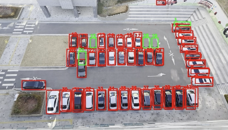
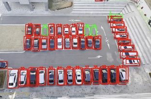

# P-Project

YOLO 기반 영상 분석 기술을 활용한 실시간 주차 점유 감지 시스템입니다.

## FastAPI 실행

`fastapi/video_test` 폴더에서 실행합니다.

```bash
cd fastapi/video_test
./venv/bin/python -m uvicorn server0:app --host 0.0.0.0 --port 8000
```

FastAPI 상태 API:

- `GET /status`

## Spring Boot 실행

Spring Boot는 FastAPI의 `/status`를 주기적으로 가져와서 앱용 API로 다시 제공합니다.

FastAPI가 기본 포트(`http://localhost:8000`)에서 실행되면 환경변수 없이 바로 실행할 수 있습니다.

```bash
cd springboot
./gradlew bootRun
```

FastAPI를 다른 포트에서 띄운 경우에만 아래처럼 바꿉니다.

```bash
SMARTPARKING_YOLO_BASE_URL=http://127.0.0.1:8010 ./gradlew bootRun
```

Spring Boot 상태 API:

- `GET /api/parking/status`

Spring Boot 인증 API:

- `POST /auth/register`
- `POST /auth/login`

## 확인 방법

FastAPI가 먼저 떠 있어야 Spring Boot가 값을 가져올 수 있습니다.

```bash
curl http://localhost:8080/api/parking/status
```

# 결과 형식
```
{
  "last_update": 1733811532.512312,
  "P1": {
    "summary": {
      "total": 41,
      "available": 7,
      "disabled_available": 0
    },
    "slots": [...]
  },
  "P2": {
    "summary": {
      "total": 36,
      "available": 5,
      "disabled_available": 3
    },
    "slots": [...]
  },
  "P3": {
    "summary": {
      "total": 0,
      "available": 0,
      "disabled_available": 0
    },
    "slots": []
  }
}
```

# 🚗 Parking Slot Detection Project (P-Project)

This project uses a **YOLO-based vehicle detection model** to automatically identify whether each parking slot is occupied or free.  
The system detects vehicles in images or video frames and checks whether the center point of each detected bounding box lies inside predefined parking slot regions.

The model is trained on the VisDrone dataset and provides accurate detection performance for cars, vans, trucks, and motorcycles.

---

## 📌 Features

- Real-time vehicle detection using YOLOv8  
- Parking slot coordinate mapping for partitions (1–3)  
- Automatic occupancy calculation for each slot  
- Video frame extraction for detection tasks  
- JSON/Python-based slot coordinate storage  

---

## 📥 Download Model Weights

You can download the YOLOv8 VisDrone model from HuggingFace:

👉 **YOLOv8 VisDrone Weights**  
https://huggingface.co/Mahadih534/YoloV8-VisDrone

After downloading, place the file inside the `weights/` directory.

---

## 📊 Results

Here are the visual results of the Parking Slot Detection system. The model effectively identifies vehicle types and maps them to predefined parking areas to determine occupancy.

| | |
|:---:|:---:|
|  |  |
|  |  |
