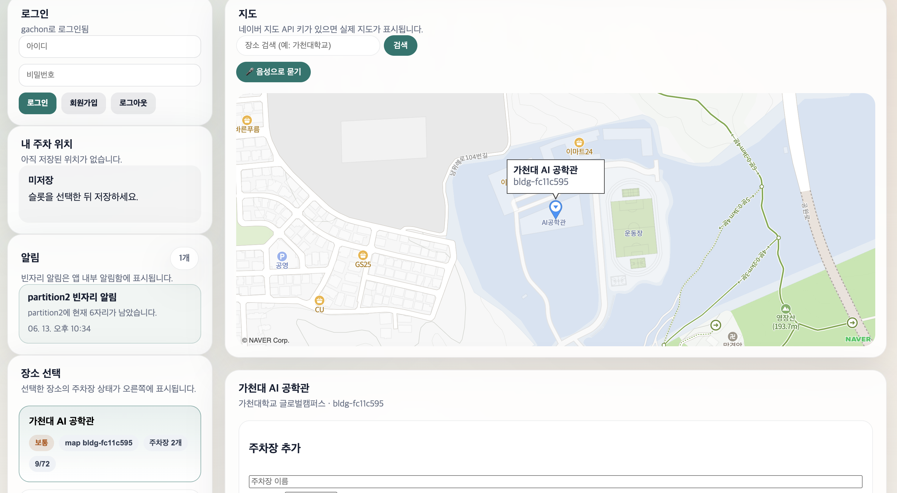
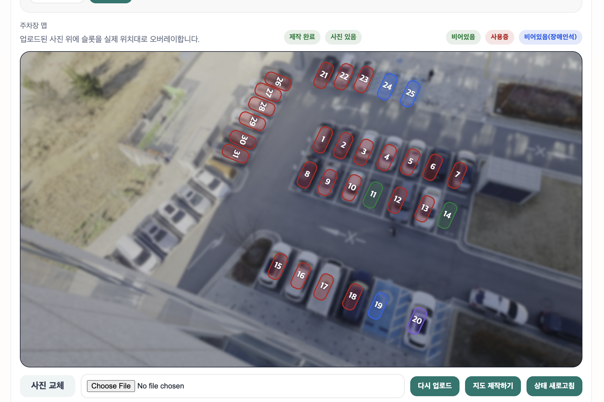
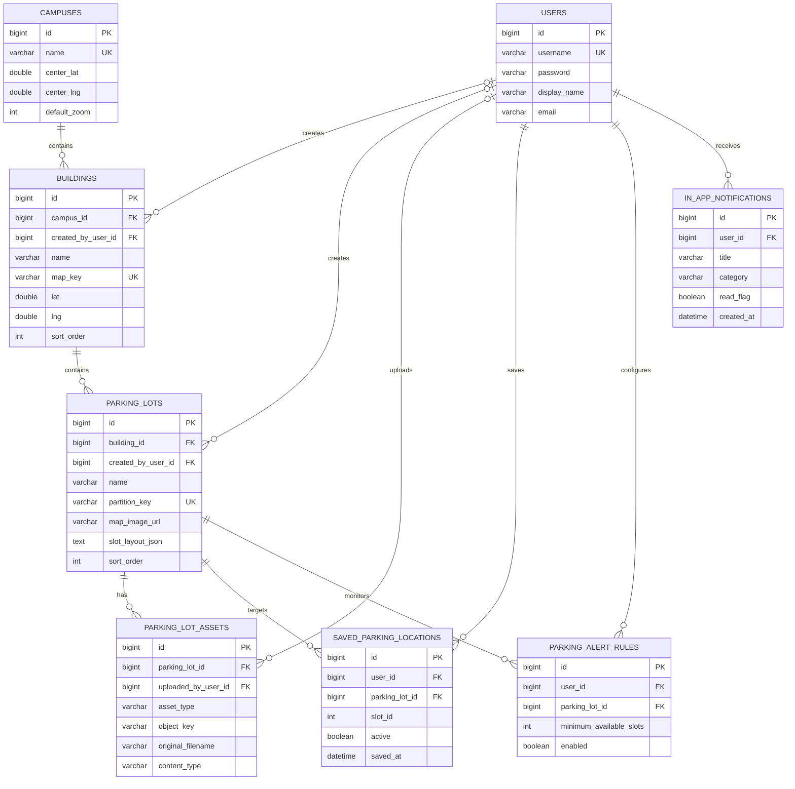

# 말해주차 (Smart Parking)

> YOLO 영상분석으로 주차 점유를 자동 감지하고, 그 현황을 **웹**에서 지도·검색·음성으로 확인하는 스마트 주차 시스템

영상에서 차량을 탐지해 빈자리를 실시간 계산하고, 사용자는 지도에서 주차장을 찾거나 *"AI공학관 빈자리 있어?"* 처럼 음성으로 물어볼 수 있습니다.

---

## 데모

### 🖥️ 웹 시연 

https://github.com/user-attachments/assets/75c39284-f4ce-4d63-8e52-62084096cfc9


### 🎤 음성 질의 _(실시간 · 소리 포함)_

https://github.com/user-attachments/assets/24441991-839a-4149-a5fb-b14758774339


---

## 주요 기능

- **점유 감지**: YOLO가 영상에서 차량을 탐지해 주차장별 빈자리/총칸 계산 (추론 주기 약 10초)
- **지도 기반 등록(웹)**: 지도에서 위치를 클릭해 장소·주차장을 동적 등록(영상 업로드)·삭제. 데이터는 영속 저장
- **장소 검색**: 장소명 검색(네이버 지역검색)으로 지도 이동
- **음성 질의**: 음성/텍스트 질문 → 정확한 수치는 규칙 기반 계산 → Gemini 또는 로컬 Ollama(`qwen2.5:1.5b`)가 자연어 답변 정리 → 음성 출력
- **웹 사용자 기능**: 주차장별 현황(여유/혼잡/만차), 슬롯 사진 오버레이, 즐겨찾기, 내 주차위치 저장·추적, 빈자리 알림·알림함

---

## 결과 화면

| 지도에서 핀 찍어 장소·주차장 등록 | 웹 주차 현황 |
|:---:|:---:|
|  |  |

---

## 아키텍처 / 폴더 구조

```
P-Project/
├─ fastapi/
│  ├─ parking_yolo/  YOLO 분석·소스 탐색 모듈
│  ├─ weights/       YOLO 가중치 파일 위치(별도 준비)
│  ├─ server0.py     FastAPI 서버
│  ├─ Dockerfile
│  └─ requirements.txt
├─ springboot/
│  ├─ src/main/java/     Spring Boot API·서비스·저장소
│  ├─ src/main/resources/static/  웹 UI
│  ├─ Dockerfile
│  └─ build.gradle
├─ docs/                  구조·기능·보고서 문서
├─ .env.example           환경변수 예시
└─ docker-compose.yml     전체 서비스 실행 설정
```

| 폴더 | 설명 | 기술 |
|---|---|---|
| `fastapi/` | 영상에서 차량 탐지 → 슬롯 점유 계산 (`/status`) | Python, FastAPI, Ultralytics YOLO, OpenCV |
| `springboot/` | 장소/주차장 API + 웹 UI + 인증 + 음성·검색·파일 저장 프록시 | Java 17, Spring Boot, JPA, PostgreSQL, Spring Security, MinIO |

> 웹 → Spring Boot(8080) → PostgreSQL / MinIO / FastAPI(8000) / Ollama(11434).

---

## 사전 준비 (Prerequisites)

| 도구 | 버전 | 용도 |
|---|---|---|
| Java (JDK) | 17 | Spring Boot |
| Docker | 최신 | Compose 실행 및 로컬 Ollama |
| API 키 | — | 네이버 지도/검색, Gemini(선택) |

```bash
# macOS 예시
brew install openjdk@17
```

---

## 설치 & 실행

### 1) 저장소 받기

```bash
git clone -b final https://github.com/a4527/P-Project.git
cd P-Project
```

### 2) 데이터·모델 준비 (필수 — git에 포함되지 않음)

용량/저작권 문제로 아래 파일은 저장소에 없습니다. YOLO 가중치 파일을 **별도로 준비해서** 해당 위치에 두어야 정상 동작합니다. VisDrone 데이터셋 전체가 아니라 `visDrone.pt` 파일이 필요합니다.

| 두는 곳 | 내용 |
|---|---|
| `fastapi/weights/visDrone.pt` | YOLO 가중치. 없으면 FastAPI 시작 시 모델 로드에서 **에러** |

> **DB와 MinIO는 비어 있는 상태로 시작합니다.** 실행 후 웹 지도에서 직접 장소·주차장을 등록하고, 애플리케이션 화면에서 영상/이미지를 업로드하면 됩니다. 업로드한 원본 파일은 MinIO에, 주차장/asset 메타데이터는 현재 프로필의 DB에 저장됩니다.

### 3) 환경변수(API 키) 설정

`.env.example`를 참고해 키를 환경변수로 등록합니다 (아래 [환경변수](#환경변수-api-키) 표 참고).

### 4) Docker Compose로 전체 시스템 실행

Docker Desktop의 WSL integration을 켠 뒤 프로젝트 루트에서 실행합니다.

```bash
docker compose up --build
```

- Spring Boot 웹/API: <http://localhost:8080/>
- FastAPI(YOLO): <http://localhost:8000/>
- Ollama(Local LLM): <http://localhost:11434/>
- Spring Boot와 FastAPI는 Docker 네트워크에서 통신합니다.
- Gemini API 키가 없으면 Ollama의 `qwen2.5:1.5b`를 사용합니다.
- 영상/이미지 원본은 MinIO에 저장되며, Docker volume으로 유지됩니다.
- YOLO 모델 파일만 `fastapi/weights/visDrone.pt`에 준비하면 됩니다. Python 가상환경은
  Docker 실행에 필요하지 않습니다.

---

## DB 확인 방법

DB는 PostgreSQL만 사용하며, 접속 방식은 `psql` 또는 컨테이너 내부 접속입니다.

```bash
psql -h localhost -p 5432 -U smartparking -d smartparking
```

```bash
docker exec -it smartparking-postgres psql -U smartparking -d smartparking
```

자주 보는 테이블:

- `campuses`: 캠퍼스
- `buildings`: 건물
- `parking_lots`: 주차장
- `parking_lot_assets`: 주차장 영상·이미지 메타데이터
- `users`: 사용자(비밀번호는 조회하지 않는 것을 권장)
- `parking_alert_rules`: 빈자리 알림 규칙
- `in_app_notifications`: 실제 발송된 알림
- `saved_parking_locations`: 내 주차 위치

### DB 관계도


```mermaid
erDiagram
    CAMPUSES ||--o{ BUILDINGS : contains
    USERS o|--o{ BUILDINGS : creates
    BUILDINGS ||--o{ PARKING_LOTS : contains
    USERS o|--o{ PARKING_LOTS : creates
    PARKING_LOTS ||--o{ PARKING_LOT_ASSETS : has
    USERS o|--o{ PARKING_LOT_ASSETS : uploads
    USERS ||--o{ SAVED_PARKING_LOCATIONS : saves
    PARKING_LOTS ||--o{ SAVED_PARKING_LOCATIONS : targets
    USERS ||--o{ PARKING_ALERT_RULES : configures
    PARKING_LOTS ||--o{ PARKING_ALERT_RULES : monitors
    USERS ||--o{ IN_APP_NOTIFICATIONS : receives

    CAMPUSES {
        bigint id PK
        varchar name UK
        double center_lat
        double center_lng
        int default_zoom
    }
    BUILDINGS {
        bigint id PK
        bigint campus_id FK
        bigint created_by_user_id FK
        varchar name
        varchar map_key UK
        double lat
        double lng
        int sort_order
    }
    PARKING_LOTS {
        bigint id PK
        bigint building_id FK
        bigint created_by_user_id FK
        varchar name
        varchar partition_key UK
        varchar map_image_url
        text slot_layout_json
        int sort_order
    }
    PARKING_LOT_ASSETS {
        bigint id PK
        bigint parking_lot_id FK
        bigint uploaded_by_user_id FK
        varchar asset_type
        varchar object_key
        varchar original_filename
        varchar content_type
    }
    USERS {
        bigint id PK
        varchar username UK
        varchar password
        varchar display_name
        varchar email
    }
    SAVED_PARKING_LOCATIONS {
        bigint id PK
        bigint user_id FK
        bigint parking_lot_id FK
        int slot_id
        boolean active
        datetime saved_at
    }
    PARKING_ALERT_RULES {
        bigint id PK
        bigint user_id FK
        bigint parking_lot_id FK
        int minimum_available_slots
        boolean enabled
    }
    IN_APP_NOTIFICATIONS {
        bigint id PK
        bigint user_id FK
        varchar title
        varchar category
        boolean read_flag
        datetime created_at
    }
```

관계 요약:

| 관계 | 설명 |
|---|---|
| `campuses 1 : N buildings` | 하나의 캠퍼스에 여러 건물이 속함 |
| `buildings 1 : N parking_lots` | 하나의 건물에 여러 주차장이 속함 |
| `parking_lots 1 : N parking_lot_assets` | 주차장별 영상·이미지 asset 메타데이터를 관리함. `(parking_lot_id, asset_type)`는 중복 불가 |
| `users 1 : N saved_parking_locations` | 사용자가 주차 위치를 저장함 |
| `users 1 : N parking_alert_rules` | 사용자가 주차장별 빈자리 알림 규칙을 설정함 |
| `users 1 : N in_app_notifications` | 사용자에게 발송된 알림을 저장함 |
| `users 0..1 : N buildings/parking_lots/assets` | 등록자·업로더는 기존 데이터에 없을 수 있음(`nullable`) |

`parking_lot_assets.object_key`는 MinIO에 저장된 원본 객체를 가리키며, 영상 분석으로 계산되는 실시간 점유 상태는 이 DB 관계도에 포함되지 않습니다. 점유 상태는 FastAPI의 `/status` 및 Spring Boot 캐시에서 관리합니다.

#### PostgreSQL 조회 명령어(docker)

접속 후 아래 명령어를 실행합니다.

```bash
docker exec -it smartparking-postgres psql -U smartparking -d smartparking
```

```sql
-- 테이블 목록
\dt

-- 테이블 구조
\d buildings
\d parking_lots
\d parking_lot_assets

-- 전체 데이터 확인
SELECT * FROM campuses ORDER BY id;
SELECT * FROM buildings ORDER BY id;
SELECT * FROM parking_lots ORDER BY id;
SELECT * FROM parking_lot_assets ORDER BY id;

-- 건물·주차장을 함께 확인
SELECT b.id AS building_id,
       b.name AS building_name,
       p.id AS parking_lot_id,
       p.name AS parking_lot_name,
       p.partition_key
FROM buildings b
LEFT JOIN parking_lots p ON p.building_id = b.id
ORDER BY b.id, p.id;

-- 사용자별 주차 위치와 알림 규칙 확인
SELECT u.username, s.parking_lot_id, s.slot_id, s.vehicle_label,
       s.active, s.saved_at
FROM saved_parking_locations s
JOIN users u ON u.id = s.user_id
ORDER BY s.id;

SELECT u.username, r.parking_lot_id, r.minimum_available_slots,
       r.enabled, r.last_known_available_slots
FROM parking_alert_rules r
JOIN users u ON u.id = r.user_id
ORDER BY r.id;

-- 알림 최신순 확인
SELECT id, user_id, title, category, read_flag, created_at
FROM in_app_notifications
ORDER BY created_at DESC
LIMIT 50;

-- psql 종료
\q
```

호스트에 `psql`이 설치되어 있다면 컨테이너 밖에서도 접속할 수 있습니다.

```bash
PGPASSWORD=smartparking psql -h localhost -p 5432 \
  -U smartparking -d smartparking
```

`SELECT * FROM USERS`는 비밀번호 해시가 포함될 수 있으므로 운영 환경에서는
사용하지 말고, 필요한 경우 `id`, `username`, `display_name`, `email`만 조회합니다.

---

## 환경변수 (API 키)

키는 소스에 포함하지 않고 환경변수로 관리합니다. `.env.example` 참고.

| 변수 | 용도 |
|---|---|
| `SMARTPARKING_NAVER_MAP_CLIENT_ID` | 네이버 지도 표시 |
| `SMARTPARKING_NAVER_SEARCH_CLIENT_ID` / `_SECRET` | 장소명 검색(지역검색 API) |
| `SMARTPARKING_GEMINI_API_KEY` | 음성 질의 답변 정리(Gemini, 선택) |
| `SMARTPARKING_JWT_SECRET` | 로그인 JWT 서명 |
| `SMARTPARKING_DATASOURCE_DB` / `_USERNAME` / `_PASSWORD` | `docker` 프로필에서 사용하는 PostgreSQL DB명/계정 |
| `SMARTPARKING_STORAGE_BUCKET` / `_ACCESS_KEY` / `_SECRET_KEY` | MinIO 버킷/계정(기본값 있음) |

---

## 주요 API (요약)

- 조회: `GET /api/campus/map`, `GET /api/campus/buildings/{id}`
- 등록/삭제: `POST /api/buildings`, `POST /api/buildings/{id}/parking-lots`, `DELETE ...`
- 검색: `GET /api/geo/search?query=`
- 음성: `POST /api/voice/ask`
- 인증: `POST /auth/login`, `POST /auth/register`
- 내 정보(로그인 필요): `/api/me/parking-location`, `/api/me/alert-rules`, `/api/me/notifications`

자세한 설계는 [`docs/`](docs/) 참고.
FastAPI/Spring Boot 디렉토리별 구성·흐름·실행 방법은 [`docs/backend-directories.md`](docs/backend-directories.md)에 정리되어 있습니다.
기능별 사용자 흐름과 Spring Boot/FastAPI 파일 역할은 [`docs/feature-flows.md`](docs/feature-flows.md)에 정리되어 있습니다.
Spring Boot 백엔드 담당 내용 중심의 프로젝트 정리는 [`docs/my-backend-role-summary.md`](docs/my-backend-role-summary.md)에 정리되어 있습니다.
